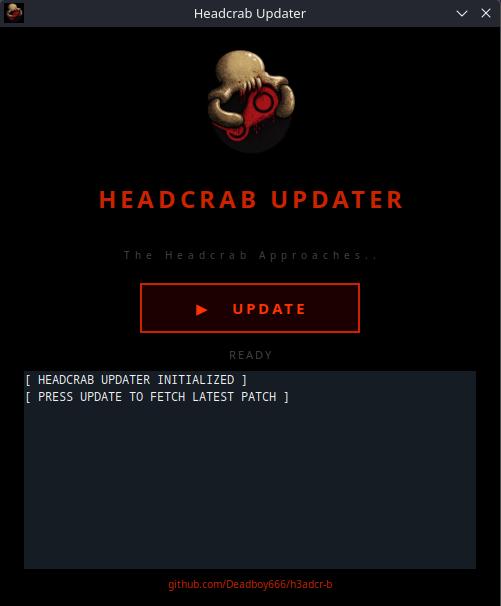

 # Headcrab Updater (GUI)

  

 

  A one-click GUI launcher for SteamDeck that fetches and applies the latest Headcrab patch from GitHub.

  
**What is it?:**
 

Headcrab Updater is a lightweight desktop app for SteamOS/SteamDeck. Instead of running a terminal command every time you want to update, just click Update and it handles everything automatically — fetching the latest patch script from GitHub and running it.
  
**Download:**
 

Head to the Head to the [Releases](https://github.com/Ke619/UI-CRAB/releases/latest) page and download `HeadcrabUpdater-x86_64.AppImage`.
 page and download HeadcrabUpdater-x86_64.AppImage.

  

 
**

  Based on : https://github.com/Deadboy666/h3adcr-b

**

