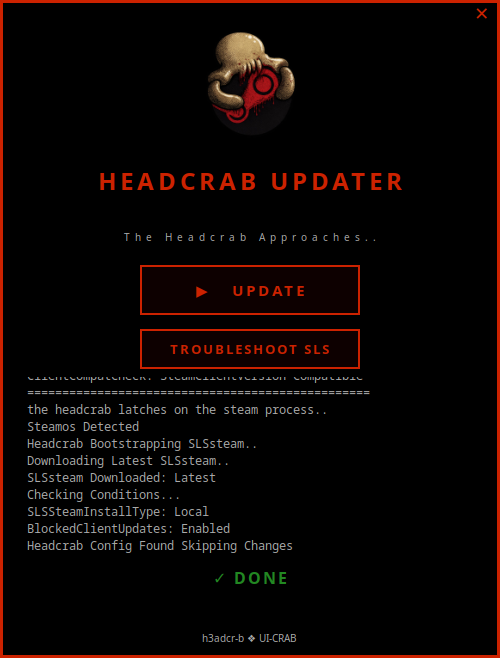

  
# Headcrab Updater (GUI)

  

 

  A one-click GUI launcher for SteamDeck that fetches and applies the latest Headcrab patch from GitHub.
 ________________________________________________________________

  
### What is it?:
Headcrab Updater is a lightweight desktop app for SteamOS/SteamDeck. Instead of running a terminal command every time you want to update, just click Update and it handles everything automatically — fetching the latest patch script from GitHub and running it.
  
### Download:
Head to the [Releases](https://github.com/Ke619/UI-CRAB/releases/latest) page and download `HeadcrabUpdater.Appimage`

  

### Background Music:
Hold the logo for 3 seconds to toggle the background music on or off. The music will loop continuously and your preference is saved — if you had it playing when you closed the app, it will automatically resume on next launch.
  
 

  Based on : https://github.com/Deadboy666/h3adcr-b

